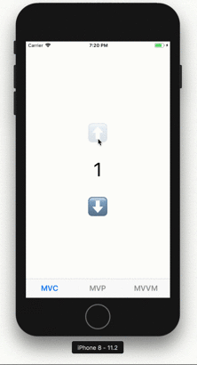

# SimplestCounterSample

This is simplest Counter App written in many variety of design patterns.

### MVC
  - Source: [MVCSampleViewController.swift](./SimplestCounterSample/MVCSampleViewController.swift)
  - Unit Test: [CountModelTestCase.swift](./SimplestCounterSampleTests/CountModelTestCase.swift)

### MVP
  - Source: [MVPSampleViewController.swift](./SimplestCounterSample/MVPSampleViewController.swift)
  - Unit Test: [CountPresenterTestCase.swift](./SimplestCounterSampleTests/CountPresenterTestCase.swift)

### MVVM
  - Source: [MVVMSampleViewController.swift](./SimplestCounterSample/MVVMSampleViewController.swift)

### MVVM with [RxSwift](https://github.com/ReactiveX/RxSwift)
  - Source: [MVVMSampleViewController.swift](./SimplestCounterSample/MVVMWithRxSwiftSampleViewController.swift)
  - Unit Test: [CountViewModelWithRxSwiftTestCase.swift](./SimplestCounterSampleTests/CountViewModelWithRxSwiftTestCase.swift)

### Flux
  - Source: [FluxSampleViewController.swift](./SimplestCounterSample/FluxSampleViewController.swift)

### Flux with [VueFlux](https://github.com/ra1028/VueFlux)
  - Source: [VueFluxSampleViewController.swift](./SimplestCounterSample/VueFluxSampleViewController.swift)

### Flux with [FluxCapacitor](https://github.com/marty-suzuki/FluxCapacitor)
  - Source: [FluxCapacitorSampleViewController.swift](./SimplestCounterSample/FluxCapacitorSampleViewController.swift)

### Flux with [RxSwift](https://github.com/ReactiveX/RxSwift)
  - Source: [FluxWithRxSwiftSampleViewController.swift](./SimplestCounterSample/FluxWithRxSwiftSampleViewController.swift)

## Run

To run this example, you need `carthage update`.

## Requirements

- Xcode 9.2 or later
- iOS 11.2 or later
- Swift 4 or later

## Author

marty-suzuki, s1180183@gmail.com

## License

SimplestCounterSample is available under the MIT license. See the LICENSE file for more info.
